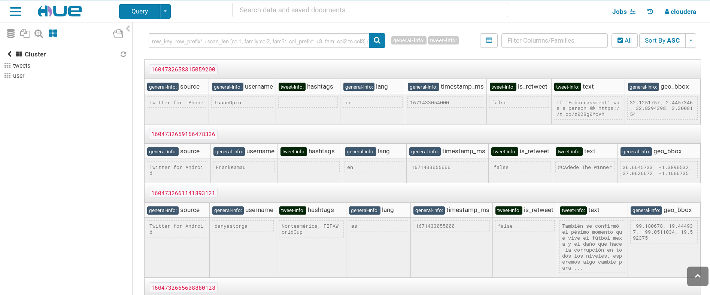

# Project name : Twitter Data Streaming, Analysis and Visualization

## Contributors:
1. Baraa Batta
2. Kidist Zihon
3. Muhenned Elmughrabi
4. Ranjan Paudel

## Synopsis:

* A project about getting current tweets as a stream in order to be stored in real time, retrieved later and do analysis on the data.

### Mission:

* Because of the huge amount of data that is continuously generated in seconds which we can use them to enhance our decisions, this project demonstrates the big data tools and technologies and how to use them to deal with these scenarios and huge data in real time.

___

## Features:

1. Create a topic you are interested in to collect info and insights about from twitter.

2. persist data in a way that allows us to handle big volume.

3. later on applying analysis and query

___


## Motivation:

**What is the vision of this product?**

> * this small demo will help us simulate and understand how to deal with big amount of data in real time in production and on cluster mode.


**What pain point does this project solve?**

> * efficient way to handle, store and analyze data that is generated at a fast pace

____

## Requirements:

1. Any OS (linux, Windows , Mac) has VM with Cloudera quick start or Docker with cloudera quick start image (includes: `Hadoop`, `Spark`, `HBase`, `Hive`) [Cloudera quick start - CentOS is preferred]
2. Kafka is needed for this project.([Download](https://kafka.apache.org/downloads) any binary)
3. Maven as build management tool for client dependencies
4. IDE(Intellij/Eclipse)
5. Twitter Developer account and Twitter API
___

## Installation and usage:
### Steps
1. Setup Twitter Stream API(v2) (base URL: `https://api.twitter.com`)
    - Create Twitter Developer account
    - Create an app and get keys
    - Save the provided keys: `API Key`, `API key secret` and `Bearer Token`
    - Only the `Bearer Token` is needed in our case
    - Use endpoint `POST /2/tweets/search/stream/rules` to create/delete rules for filtering tweets
    - Use endpoint `GET /2/tweets/search/stream` to get the stream of filtered tweets

2. Create a HBase table that will be loaded by spark streaming consumer in real time
    ```
    $ echo "create 'tweets', 'tweet-info', 'general-info'" | hbase shell
    ```

3. Clone two Repositories [producer](https://github.com/mhn998/kafka-twitter-producer) and [consumer](https://github.com/mhn998/kafka-spark-consumer)

4. Start Zookeeper server and kafka server using 
    ```
    $ bin/zookeeper-server-start.sh config/zookeeper.properties
    $ bin/kafka-server-start.sh config/server.properties
    ```

5. create kafka topic using (in our case `tweets` is the topic_name)
    ```
    $ bin/kafka-topic --create topic_name --bootstrapserver localhost:9092
    ```

6. Run kafka-twitter-producer project from the main class `org.producer.TwitterProducer` using intellij/eclipse setting on VM.<br>In docker container, build a fat jar (mvn package), copy it to container and run it using 
    ```
    $ java -cp org.producer.TwitterProducer twitter-producer-jar-with-dependencies.jar
    ```

7. Run kafka consumer from the main class `org.twitter.consumer.Listener` using intellij/eclipse setting on VM.<br>In docker container, build a fat jar (mvn package), copy it to container and run it
using
    ```
    $ java -cp org.twitter.consumer.Listener twitter-consumer-jar-with-dependencies.jar
    ```
    Or submit as a spark job
    ```
    $ spark-submit --class "org.twitter.consumer.Listener" --master {local[*] | yarn} twitter-consumer-jar-with-dependencies.jar
    ```


8. Fetching of real time streams will automatically start when running producer. On the other hand, the listener (or consumer) will be listening to these events on that topic continuously 
using spark streaming in order to be able to save this data directly to our HBase table with two main column families, `tweet-info` and `general-info`

9. Optionally start the hive script to create external table for hive and load the data of HBase to hive
    ```
    CREATE EXTERNAL TABLE tweets (
        id Bigint,
        username String,
        text String,
        is_retweet boolean,
        hashtags String,
        timestamp_ms Bigint,
        lang String,
        source String,
        geo_bbox String
    )
    STORED BY 'org.apache.hadoop.hive.hbase.HBaseStorageHandler'
        WITH SERDEPROPERTIES (
            'hbase.columns.mapping'=':key,general-info:username,tweet-info:text,tweet-info:is_retweet,tweet-info:hashtags,general-info:timestamp_ms,general-info:lang,general-info:source,general-info:geo_bbox'
        )
        TBLPROPERTIES(
            'hbase.table.name'='tweets',
            'hbase.mapred.output.outputtable'='tweets'
        );
    ```

10. Optionally start sparkSql class in consumer to do further real time queries on the data in HBase
____

## Non-functional requirments:

* Data integrity.
* Portability.
* Reliability.
* Adaptability
____

## Screenshots
HBase table loaded by spark streaming kafka consumer



## Twitter API references:

https://developer.twitter.com/en/docs/twitter-api

## SparkSQL part
https://github.com/barahijawi/sparkSQL-BDT
